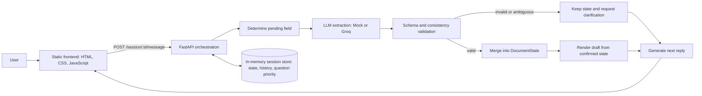

# Personal Wishes Intake Assistant

> A conversational intake experience that turns a casual discussion into a structured, reviewable personal wishes draft.

[](https://www.python.org/)
[](https://fastapi.tiangolo.com/)
[](#testing)
[](#frontend)

**Fictional demonstration only.** The generated draft is not legal advice and is not a legally binding document.

---

## What it does

The assistant asks for personal-wishes details one question at a time, while accepting clearly stated extra details in the same message. It validates every proposed update before changing the draft, so the document is always rendered from confirmed structured state.

| Capability | Implementation |
| --- | --- |
| Conversational intake | Tracks the next missing field and uses recent turns for reply continuity. |
| Structured state | Each document field is explicitly `unknown` or `confirmed`. |
| Safe updates | LLM output is parsed, validated, then merged only when valid. |
| Live draft | The document preview is rendered directly from confirmed state. |
| Mock mode | Regex-based development mode works without an API key. |
| Live mode | Optional Groq client uses an OpenAI-compatible chat API. |
| Inspectable UI | The Details view makes confirmed and still-needed information visible. |

## Architecture



### Core rule

`DocumentState` is the source of truth. Conversation history helps the assistant reply naturally, but it never writes directly to the draft.

## Project layout

```text
app/
??? main.py              # FastAPI routes and turn orchestration
??? schema.py            # Pydantic API, state, and update models
??? state.py             # In-memory sessions, merge logic, pending fields
??? validation.py        # Schema and consistency checks
??? document.py          # Deterministic draft renderer
??? llm/
    ??? interface.py     # Shared LLM contract
    ??? mock_client.py   # Offline regex-based client
    ??? real_client.py   # Groq-backed client
frontend/
??? index.html
??? styles.css
??? app.js
tests/
??? test_core_flow.py    # Small, high-value regression suite
AI_LOG.md                # Development decisions and corrected iterations
```

## Quick start

### 1. Create the environment

Requires **Python 3.10+**.

```powershell
python -m venv .venv
.\.venv\Scripts\Activate.ps1
pip install -r requirements.txt
```

### 2. Start the API

Mock mode is the default and does not require an API key.

```powershell
$env:LLM_PROVIDER = "mock"
python -m uvicorn app.main:app --reload
```

The API runs at `http://localhost:8000`. Interactive API documentation is available at `http://localhost:8000/docs`.

### 3. Start the frontend

In a second terminal:

```powershell
python -m http.server 5500 --directory frontend
```

Open `http://localhost:5500`.

> The frontend base URL is defined once at the top of [`frontend/app.js`](frontend/app.js). Change `API_BASE` if the backend runs elsewhere.

## Optional live LLM mode

Copy the example environment file and add a Groq API key:

```powershell
Copy-Item .env.example .env
```

```dotenv
LLM_PROVIDER=groq
GROQ_API_KEY=your_key_here
GROQ_MODEL=openai/gpt-oss-120b
```

Then start the API normally. If Groq is selected without a usable key, the application falls back to mock mode.

## API overview

| Method | Endpoint | Purpose |
| --- | --- | --- |
| `GET` | `/` | Health status and active LLM provider. |
| `POST` | `/session` | Create an in-memory conversation session. |
| `POST` | `/session/{id}/message` | Process a user turn and return reply, state, draft, and pending questions. |
| `GET` | `/session/{id}/state` | Get the current structured state. |
| `GET` | `/session/{id}/document` | Get the current rendered draft. |
| `GET` | `/session/{id}/history` | Get the role, text, and timestamp conversation history. |

### Example turn

```bash
# Create a session
curl -X POST http://localhost:8000/session

# Send a message using the returned session_id
curl -X POST http://localhost:8000/session/<session_id>/message   -H "Content-Type: application/json"   -d '{"message":"My name is Saitama"}'
```

A message response includes:

```json
{
  "assistant_reply": "...",
  "state": { "full_name": { "status": "confirmed", "value": "Saitama" } },
  "document": "...",
  "pending_questions": ["home address"]
}
```

## Conversation and safety design

- **Pending-field anchoring:** short answers are interpreted against the active question, preventing a children-name answer from becoming executor data.
- **Multi-detail turns:** explicitly stated details can be collected together after validation.
- **Ambiguity is preserved:** statements such as ?my children are named after Melissa? do not invent names; the assistant asks for the actual names.
- **No raw internals in chat:** provider, parsing, and Pydantic errors are logged server-side and translated into a clear user-facing clarification.
- **Draft rendering is deterministic:** no LLM call writes the final document text directly.

## Frontend

The frontend uses plain DOM APIs and `fetch`; there is no framework, package manager, bundler, or build step.

- Dark chat workspace paired with a paper-like draft panel
- Document and Details views
- Live confirmed/unknown field treatment
- Mock/live provider badge
- Keyboard focus states, labels, and an `aria-live` chat log
- Responsive mobile pane switcher

## Testing

The repository intentionally keeps a small test suite focused on the highest-risk behavior:

```powershell
python -m pytest -q
```

The core tests cover:

- State and document updates after a confirmed value
- Children-name extraction scoped to the active field
- Ambiguous ?named after? phrasing
- Off-topic messages not mutating document state
- Conversation history retention

## AI development log

See [AI_LOG.md](AI_LOG.md) for key prompts, notable iterations, and examples of output that were questioned or corrected during implementation.

For local pipeline diagnostics, set the following before starting the API:

```powershell
$env:LLM_DEBUG_LOGGING = "true"
```

This writes structured extraction, validation, merge, and reply diagnostics to the server terminal. It may contain conversation details, so use it only during local development.

## Production improvements

This project intentionally uses an in-memory store for the exercise. A production version would add:

- Durable session storage with expiry and encryption at rest
- Authentication and per-user authorization
- Strict production CORS origins and HTTPS
- Rate limiting, request-size limits, and audit retention rules
- Provider timeouts, retries, observability, and cost controls
- Background document export and secure download handling
- Automated evaluation cases for extraction quality and prompt regressions

---

Built as a focused technical exercise in conversational data collection, structured validation, and deterministic document rendering.
